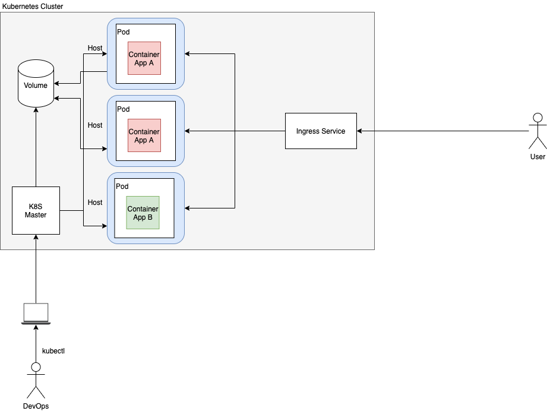

# Kubernetes

A diagram with three host machines in a Kubernetes cluster. The cluster is running two applications: A and B.

The “DevOps” with a computer is in the diagram as the one sending instructions via kubectl to deploy an application. An HTTP message coming from the internet to the Kubernetes cluster originating from a user is illustrated and handled by the Ingress Service.

A storage volume is also present in the diagram.

